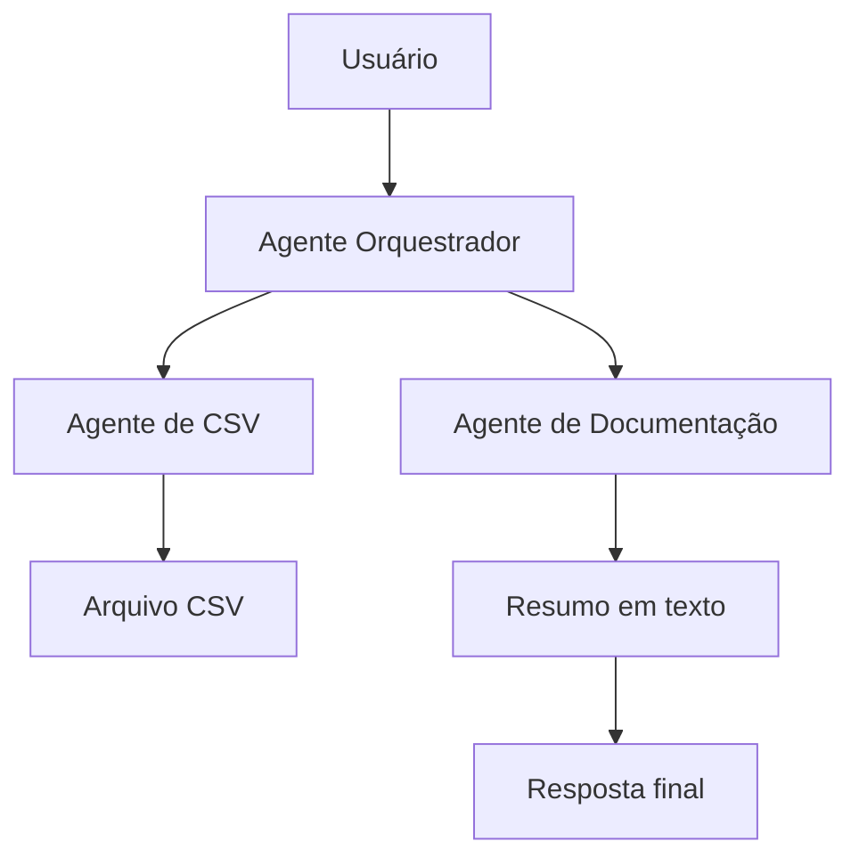

# CSV + IA Agents

Este projeto foi desenvolvido como exemplo de aula para demonstrar a combinação de:

- API em FastAPI;
- processamento de arquivos CSV;
- agentes especializados em IA;
- arquitetura com subagentes;
- documentação em Mermaid;
- resposta textual estruturada para o usuário.

## Objetivo da aula

O projeto mostra como um fluxo simples de dados pode evoluir para um cenário de agentes:

1. o usuário envia um arquivo CSV;
2. um agente analisa os dados;
3. um agente de documentação transforma o resultado em texto;
4. a arquitetura é visualizada com diagramas Mermaid;
5. a solução é apresentada de forma didática, com foco em aprendizado.

## Arquitetura do projeto



## Componentes

- API: recebe upload de arquivos CSV;
- CSVAnalysisAgent: lê colunas, linhas e prévia de dados;
- DocumentationAgent: gera relatório em texto;
- CoordinatorAgent: orquestra os subagentes;
- skills/: arquivos de skill usados para definir comportamento do agente;
- docs/mermaid-diagrams.md: guarda os diagramas da solução;
- agents/: arquivos de prompt dos agentes.

## Conceito de Skill

A skill funciona como uma especialização de comportamento do agente. Ela define o que ele sabe fazer e quando deve fazer.

Exemplo no projeto:

- `CSV Analyst`: entende como processar arquivos CSV;
- `Agent Orchestration`: sabe coordenar subagentes e consolidar o resultado.

A ideia é que o agente não execute tudo ao mesmo tempo; ele usa as skills como instruções de domínio para agir de forma mais inteligente.

## Estrutura do repositório

```text
exercicios-aula-ia/
├── agents/
│   ├── csv_agent_prompt.md
│   └── orchestrator_prompt.md
├── skills/
│   ├── csv_skill.md
│   └── agent_skill.md
├── csv_api_sender/
│   ├── __init__.py
│   ├── agents.py
│   ├── agent_cli.py
│   └── app.py
├── docs/
│   └── mermaid-diagrams.md
├── tests/
│   └── test_csv_api.py
├── README.md
├── requirements.txt
├── exemplo.csv
├── artifacts/
│   └── resumo_csv.txt
└── .venv/
```

## Como executar a API

1. Crie o ambiente virtual:

```powershell
python -m venv .venv
.\.venv\Scripts\Activate.ps1
```

2. Instale as dependências:

```powershell
python -m pip install -r requirements.txt
```

3. Inicie a API:

```powershell
python -m uvicorn csv_api_sender.app:app --host 127.0.0.1 --port 8000
```

4. Acesse a documentação Swagger:

```text
http://127.0.0.1:8000/docs
```

5. Faça upload do arquivo CSV no endpoint `/upload-csv`.

## Como testar a arquitetura de agentes

Execute o CLI do projeto com um arquivo CSV real:

```powershell
python csv_api_sender\agent_cli.py exemplo.csv --output-dir artifacts
```

Saída esperada:

- análise do arquivo;
- name do arquivo;
- colunas detectadas;
- linhas encontradas;
- relatório salvo em `artifacts/resumo_csv.txt`;
- resposta em texto para o usuário.

## Exemplo de CSV

```csv
nome,idade
Ana,30
Joao,25
Maria,27
```

## Testes automatizados

```powershell
python -m pytest -q
```

## Documentação de prompts e skills

Os prompts dos agentes ficam em:

- [agents/csv_agent_prompt.md](agents/csv_agent_prompt.md)
- [agents/orchestrator_prompt.md](agents/orchestrator_prompt.md)

As skills ficam em:

- [skills/csv_skill.md](skills/csv_skill.md)
- [skills/agent_skill.md](skills/agent_skill.md)

Esses arquivos mostram como a IA entende o contexto e qual comportamento deve ter em cada etapa do fluxo.

## Observações para a aula

Este projeto é uma versão didática e simplificada, criada para demonstrar os conceitos de:

- agente especializado;
- skill de domínio;
- orquestração de subagentes;
- processamento de arquivos;
- documentação visual em Mermaid;
- comunicação entre módulos de IA e backend.

A ideia central é mostrar como a skill ajuda o agente a agir corretamente dentro do contexto do projeto.

## Roteiro de fala para apresentação

### 1. Introdução
Neste projeto, criamos uma arquitetura simples com agentes de IA para processar um arquivo CSV e transformar os dados em um resumo legível.

### 2. Agente
O agente recebe o arquivo e interpreta o contexto. Ele usa instruções específicas para saber o que fazer com o dado.

### 3. Skill
A skill define a especialização do agente. No exemplo, uma skill de CSV identifica colunas e linhas, enquanto outra orquestra a execução dos subagentes.

### 4. Subagentes
O fluxo é dividido em pequenas tarefas: análise do arquivo e documentação do resultado. Isso deixa o sistema mais organizado e facilita a manutenção.

### 5. Mermaid
Os diagramas mostram visualmente como os componentes se relacionam e ajudam na explicação do projeto.

### 6. Resultado
Ao final, o usuário recebe uma resposta clara, com resumo do arquivo e documentação do processo.
# exercicios-de-treinamento
