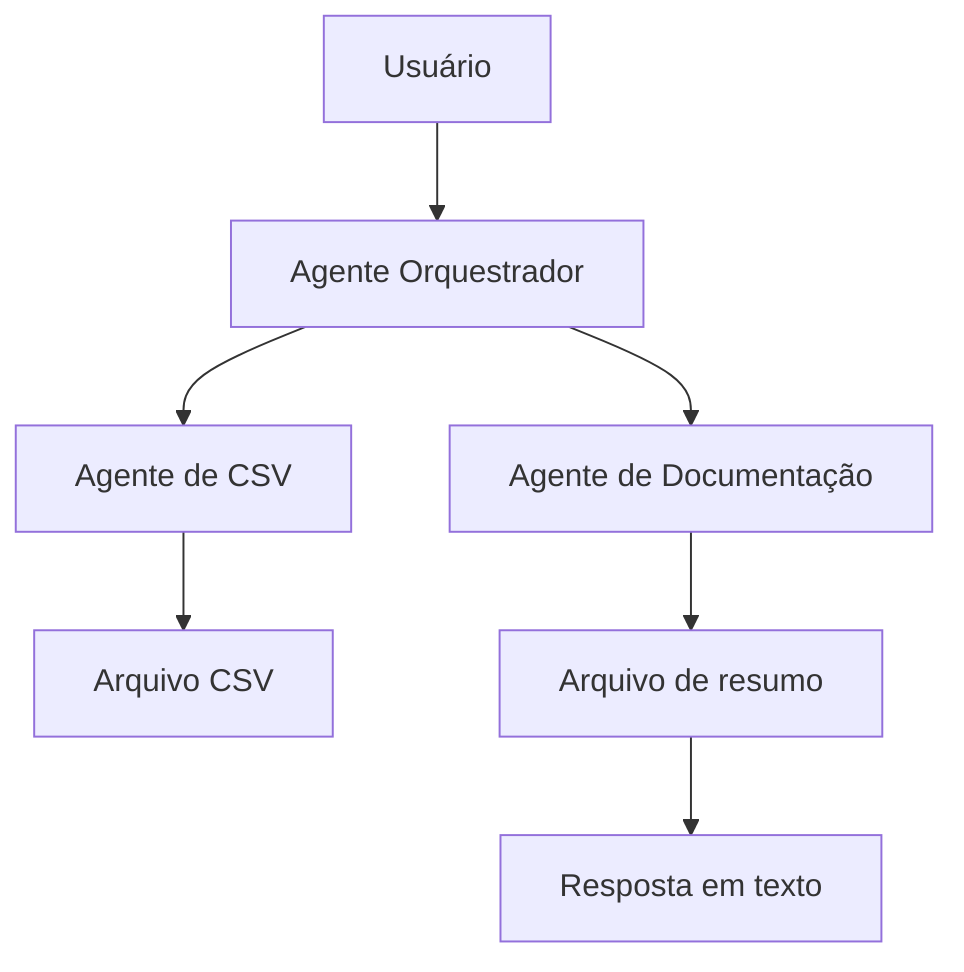
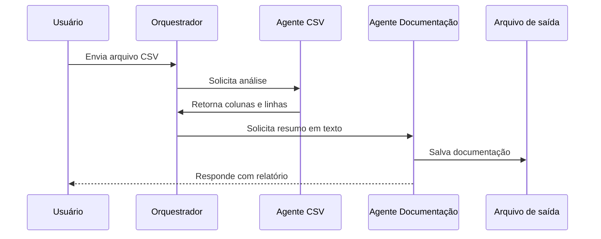
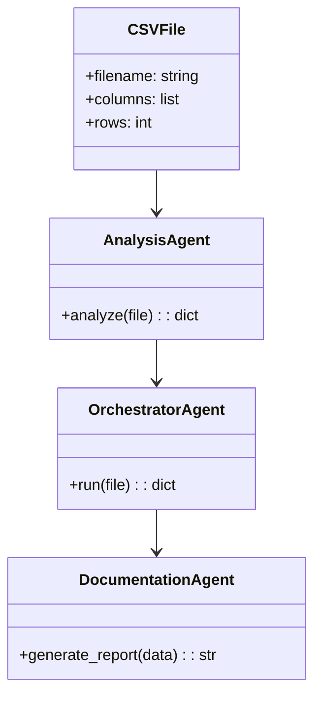

# Diagramas Mermaid do projeto

## Arquitetura geral

```mermaid
flowchart TD
    A[Usuário] --> B[Agente Orquestrador]
    B --> C[Agente de CSV]
    B --> D[Agente de Documentação]
    C --> E[Arquivo CSV]
    D --> F[Arquivo de resumo]
    F --> G[Resposta em texto]
```

## Fluxo do pipeline

```mermaid
sequenceDiagram
    participant U as Usuário
    participant O as Orquestrador
    participant C as Agente CSV
    participant D as Agente Documentação
    participant F as Arquivo de saída

    U->>O: Envia arquivo CSV
    O->>C: Solicita análise
    C->>O: Retorna colunas e linhas
    O->>D: Solicita resumo em texto
    D->>F: Salva documentação
    D-->>U: Responde com relatório
```

## Modelo de dados

```mermaid
classDiagram
    class CSVFile {
        +filename: string
        +columns: list
        +rows: int
    }

    class AnalysisAgent {
        +analyze(file) : dict
    }

    class DocumentationAgent {
        +generate_report(data) : str
    }

    class OrchestratorAgent {
        +run(file) : dict
    }

    CSVFile --> AnalysisAgent
    AnalysisAgent --> OrchestratorAgent
    OrchestratorAgent --> DocumentationAgent
```
