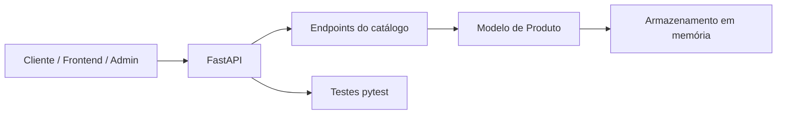

# E-commerce Catalog API

[](https://www.python.org/)
[](https://fastapi.tiangolo.com/)
[](https://pytest.org/)
[](https://github.com/Fission-AI/OpenSpec)

API RESTful para gestão do catálogo de produtos de um e-commerce, criada como estudo prático de Spec-Driven Development com OpenSpec, FastAPI e testes automatizados.

## Visão geral

Este projeto demonstra um fluxo de trabalho moderno para construir software com clareza e rastreabilidade:

- proposta de mudança com OpenSpec
- especificação de requisitos em arquivos de projeto
- desenho técnico e arquitetura
- implementação em FastAPI
- testes automatizados para validar o comportamento
- documentação progressiva para manter o contexto enxuto

## Objetivo do projeto

O objetivo principal é mostrar como uma solução de catálogo de produtos pode evoluir de forma organizada, com regras de negócio claras, documentação separada por contexto e uma estrutura pronta para ser expandida.

## Arquitetura



## Funcionalidades implementadas

- Cadastro de produtos
- Listagem de todos os produtos
- Consulta por identificador
- Atualização de produto
- Remoção de produto
- Validação de payloads e erros HTTP consistentes

## Stack tecnológica

- Python 3.11+
- FastAPI
- Pydantic
- pytest
- OpenSpec

## Estrutura do projeto

```text
 e-commerce/
├── app.py
├── __init__.py
├── agents.md
├── README.md
├── requirements.txt
├── .gitignore
├── docs/
│   ├── overview.md
│   ├── architecture.md
│   ├── crud-api.md
│   ├── testing.md
│   └── api-examples.md
├── openspec/
│   ├── config.yaml
│   └── changes/
│       └── 2026-08-18-product-catalog-api/
├── tests/
│   └── test_ecommerce_api.py
└── LICENSE
```

## Como executar

1. Crie o ambiente virtual:

```powershell
python -m venv .venv
.\.venv\Scripts\Activate.ps1
```

2. Instale as dependências:

```powershell
python -m pip install -r requirements.txt
```

3. Inicie a API:

```powershell
python -m uvicorn ecommerce.app:app --host 127.0.0.1 --port 8000 --reload
```

4. Acesse a documentação interativa do Swagger:

```text
http://127.0.0.1:8000/docs
```

## Endpoints principais

| Método | Endpoint | Descrição |
|---|---|---|
| POST | /products | Cria um novo produto |
| GET | /products | Lista todos os produtos |
| GET | /products/{product_id} | Consulta um produto por ID |
| PUT | /products/{product_id} | Atualiza um produto |
| DELETE | /products/{product_id} | Remove um produto |

## Regras de negócio

- nome, descrição, preço e estoque são obrigatórios
- preço deve ser maior que zero
- estoque deve ser maior ou igual a zero
- produto inexistente deve retornar 404
- payload inválido deve retornar 422

## Exemplos de payload

### Criar produto

```json
{
  "name": "Notebook Gamer",
  "description": "Notebook para jogos e produtividade",
  "price": 4999.9,
  "stock": 12
}
```

### Atualizar produto

```json
{
  "name": "Notebook Gamer Pro",
  "description": "Notebook com melhor desempenho",
  "price": 5499.9,
  "stock": 8
}
```

## Testes

Execute a suíte automatizada:

```powershell
python -m pytest -q
```

Resultado esperado:

```text
5 passed
```

## Workflow OpenSpec

O projeto foi estruturado com o fluxo de Spec-Driven Development:

1. proposta da mudança
2. especificação de requisitos
3. desenho técnico
4. checklist de implementação
5. aplicação da mudança
6. arquivamento do change

## Documentação complementar

- [docs/overview.md](docs/overview.md)
- [docs/architecture.md](docs/architecture.md)
- [docs/crud-api.md](docs/crud-api.md)
- [docs/testing.md](docs/testing.md)
- [docs/api-examples.md](docs/api-examples.md)
- [docs/roadmap.md](docs/roadmap.md)
- [agents.md](agents.md)

## Status do projeto

Status atual: funcional, validado por testes automatizados e pronto para demonstração acadêmica.

## Roadmap

- [ ] adicionar persistência com banco de dados
- [ ] implementar autenticação e autorização
- [ ] incluir categorias e filtros de catálogo
- [ ] adicionar painel administrativo
- [ ] evoluir para arquitetura multi-service

## Contribuição

Contribuições são bem-vindas. Para colaborar:

1. faça um fork do projeto
2. crie uma branch para sua feature
3. implemente e teste a mudança
4. abra um pull request com descrição clara

Consulte [CONTRIBUTING.md](CONTRIBUTING.md) para mais detalhes.

## Observações

Este é um projeto didático e simplificado, pensado para demonstrar boas práticas de documentação, especificação, validação e evolução de software com IA.

## Licença

Este projeto está disponível sob a licença MIT. Consulte [LICENSE](LICENSE).
